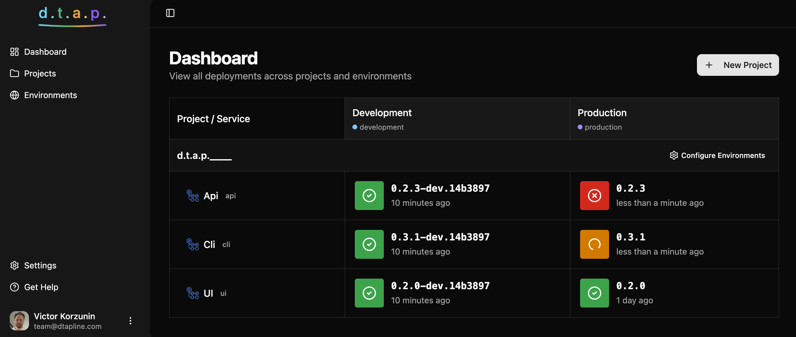

# Dtapline

**Track and visualize deployments across your environments and services.**

Dtapline helps teams answer questions like "What version is running in production?" and "When was the last deployment to staging?" with a simple 2D matrix dashboard. Integrate with your CI/CD pipeline to automatically report deployments.



_Inspired by [Octopus Deploy](https://octopus.com/)'s deployment dashboard. And designed for open-source projects._

## Quick Start

### CLI Usage

The CLI allows you to report deployments from CI/CD pipelines:

```sh
cd packages/cli

# Using API key from environment
export DTAPLINE_API_KEY=cm_xxxxxxxxxxxxx

# Report a deployment
pnpm --package=@dtapline/cli dlx dtapline deploy \
  production \
  api-service \
  abc123def456 \
  --status success \
  --deployed-version v1.2.3 \
  --deployed-by "Jenkins" \
```

See [packages/cli/README.md](packages/cli/README.md) for full documentation.
